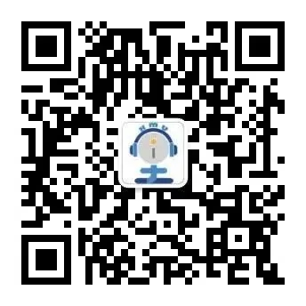

图书馆相关资源及链接，关于图书馆的各种信息均可在 [https://library.xmu.edu.cn](https://library.xmu.edu.cn) 上面查询。

维护者：[rogerchenfz](https://github.com/rogerchenfz)

贡献者：[rogerchenfz](https://github.com/rogerchenfz)、厦门大学图书馆相关老师

## 友情链接

- 主页：[厦门大学图书馆](https://library.xmu.edu.cn) &nbsp; bilibili账号：[厦大图书馆](https://space.bilibili.com/474387811/)
- 概况：[思明校区图书馆简介](https://library.xmu.edu.cn/gk/smxqtsg1/jj.htm)、[德旺图书馆](https://libx.xmu.edu.cn/)、[信息工程分馆](https://library.xmu.edu.cn/gk/xxgcfg.htm)、[经济与管理分馆](https://library.xmu.edu.cn/gk/jjyglfg.htm)、[法学与艺术分馆](https://library.xmu.edu.cn/gk/fxyysfg.htm)、[漳州分馆](http://library.xujc.cn/)、[储存图书馆](https://libx.xmu.edu.cn/cyfw/cctsg.htm)、[区域资料研究中心](https://library.xmu.edu.cn/gk/qyyjzlzx.htm)、[联系方式](https://library.xmu.edu.cn/gk/lxfs.htm)
- [我的图书馆](https://catalog.xmu.edu.cn/reader/login.php)：登录我的图书馆
- [玩转图书馆](https://www.bilibili.com/video/BV1oJ411s7dC)：[选座篇](https://www.bilibili.com/video/BV1oJ411s7dC)、[自助文印篇](https://www.bilibili.com/video/BV1oJ411s7dC?p=2)、[外文书库篇](https://www.bilibili.com/video/BV1oJ411s7dC?p=3)
- 图书馆服务：[开放时间](https://library.xmu.edu.cn/fw/tsjy/kfsj.htm)、[借阅权限](https://library.xmu.edu.cn/fw/tsjy/jyqx.htm)、[借阅规则](https://library.xmu.edu.cn/fw/tsjy/jygz.htm)、[座位管理规则](https://library.xmu.edu.cn/fw/zwgl/zwglgz.htm)、[研讨间预约](https://library.xmu.edu.cn/fw/ytjyy/zgyts.htm)
- 数据库：[常用数据库](https://library.xmu.edu.cn/zy/cysjk/cysjkyl.htm)、[中文数据库](https://library.xmu.edu.cn/zy/zwsjk.htm)、[外文数据库](https://library.xmu.edu.cn/zy/wwsjk.htm)、[自建数据库](https://library.xmu.edu.cn/zy/zjsjk.htm)、[电子图书](https://library.xmu.edu.cn/zy/dzts/dzs.htm)、[在线报刊](https://library.xmu.edu.cn/zy/zxbk.htm)
- [馆际互借和文献传递](https://library.xmu.edu.cn/fw/gjhj.htm)
- [科技查新](https://library.xmu.edu.cn/fw/kjcx1/cxzjj.htm)
- [失物招领](https://lib.xmu.edu.cn/lost/index.asp)
- [图书捐赠](http://donors.xmu.edu.cn)
- [校外访问VPN](https://library.xmu.edu.cn/zy/xwfw/CARSI.htm)
- [座位管理](https://lib.xmu.edu.cn/seat)
- [总馆研讨室预约](https://service.xmulib.org/rooms)
- [总馆318空间使用申请](https://service.xmulib.org/rooms/zh-hans/room_apply_318)
- [德旺图书馆研讨间预约](https://service.xmulib.org/studyroom)
- [馆长信箱](https://lib.xmu.edu.cn/ask/question_consult)
- [馆藏中外文电子图书资源介绍](https://library.xmu.edu.cn/__local/B/84/09/C54ABACC471150037FD63A66156_08111D34_1773F59.pptx?e=.pptx)：[视频](https://www.bilibili.com/video/BV1VA411j7MK)
- 厦大图书馆微信公众号 & i学堂XMU微信公众号

 

## [i学堂讲座课件](https://library.xmu.edu.cn/wd/jzkj/i_xt.htm) & [讲座视频](https://library.xmu.edu.cn/wd/jzsp.htm)
- [图书馆文献资源与获取服务全解析](https://library.xmu.edu.cn/__local/9/A2/6C/F230D69B899DE36C45DA5CD165A_47F63F33_367D7D.pdf?e=.pdf)：[视频](https://www.bilibili.com/video/BV1Xy4y1k7bH)
- [一站式检索与获取图书馆电子文献](https://library.xmu.edu.cn/__local/9/15/12/F3A2EA4DF9B280A907F82F5D54F_8337F260_7F3F5C.pptx?e=.pptx)：[视频](https://www.bilibili.com/video/BV1SE411j74g)
- [如何高效利用搜索引擎](https://library.xmu.edu.cn/__local/9/A0/09/837CCAC7A1F7E97B68AA59B0D62_4201ADA0_39E740.pdf?e=.pdf) ：[视频](https://www.bilibili.com/video/BV1XD4y1Q7ZG)
- [互联网免费学术资源的检索与利用](https://library.xmu.edu.cn/__local/E/E3/28/470DB70B1BCDBDFD4354802AF74_D518B27E_477FCD.pdf?e=.pdf)：[视频](https://www.bilibili.com/video/BV1xy4y167MS)
- [学位论文的检索与获取](https://library.xmu.edu.cn/__local/E/BE/7E/D9AE78C232A18AE6A261648AB5B_363B24BE_43691F.pdf?e=.pdf)：[视频](https://www.bilibili.com/video/BV1cv411C7Hb)
- [i学堂本部场：如何获取学术期刊全文（人文社科篇）](https://library.xmu.edu.cn/__local/B/A9/C6/9CF9F07FE856A68319DF82890FF_CA88A60B_192D6D3.pdf?e=.pdf)：[视频](https://www.bilibili.com/video/BV1Gz4y1o7YQ)
- [i学堂本部场：如何获取学术期刊全文（理工科篇）](https://library.xmu.edu.cn/__local/8/B1/11/497E5A5F12D61E1E907B7EA00B2_D1E659EA_61796C.pdf?e=.pdf)：[视频](https://www.bilibili.com/video/BV1Gz4y1o7YQ?p=2)
- [i学堂翔安场：如何获取学术期刊全文（理工科篇）](https://library.xmu.edu.cn/__local/A/77/E4/2F92F0255C6DA83BB63A6B1856B_3B2202CB_7AF0D8.pdf?e=.pdf)

