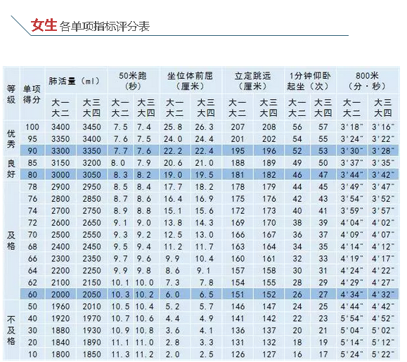

贡献者：[rogerchenfz](https://github.com/rogerchenfz)、厦门大学体育教学部相关老师和部分同学、厦门大学健身社、厦门大学跳绳协会

根据体育课程教学大纲的规定，体育课程设4个必修学分，除大一第一学期必修1学分外，其余的三个学分可在大学期间的任一学期完成，同时这三个学分可以通过不同途径来获得：一是通过正常的体育选课获取学分；二是通过特色项目来获取学分。（特色学分说明见最下方相关文件部分）

## 友情链接

- [体育课详细介绍](https://www.zhihu.com/column/c_1217834639357956096)
- [体育课目录](https://zhuanlan.zhihu.com/p/110584413)
- [体育教学部](https://tyjxb.xmu.edu.cn/)
- [学分秘籍](https://mp.weixin.qq.com/s/DPE594ZeImx-Sb28_cpB4Q)
- [体测系统](http://219.229.80.207/)：可查询体测成绩，初始密码是123456
- 厦大体育微信公众号

 
## 体测攻略

- [800米/1000米](https://mp.weixin.qq.com/s/JFNP5cQ61djt4Aut-CjYjg)
- [引体向上](https://mp.weixin.qq.com/s/8qq-ZqBhq2NwIFUqSATj5Q)
- [立定跳远](https://mp.weixin.qq.com/s/a_YQ1Lwtyv4JnU-EPD9fOw)

## “宅”运动系列

- [第一期-太极（八法五步）](https://mp.weixin.qq.com/s/i_n28T9G1XqIMHIA1adLYA)：郭琼珠
- [第二期-瑜伽（太阳致敬式）](https://mp.weixin.qq.com/s/Jvn690nptY-zrS0bY0tjlA)：胡云霞
- [第三期-厦门大学跳绳协会带你跳起来！](https://mp.weixin.qq.com/s/mdiCXiuV8nM32Gu924lZbw)：王丽娟
- [第四期-形意养生功](https://mp.weixin.qq.com/s/hyZrlL6wPAvPPDCgxZ5dPQ)：林建华
- [第五期-世界冠军带你居家练力量](https://mp.weixin.qq.com/s/PsfNP6JVS8CV4NpNYlcR-w)：倪振华
- [第六期-健身操](https://mp.weixin.qq.com/s/NMOrHbejqEhDFOPIuX4evQ)：赵秋爽
- [第七期-八段锦](https://mp.weixin.qq.com/s/ezIbtsoGXhRbosiSN5hH5A)：黄惠玲
- [第八期-厦门大学健身社居家健身“宝典”来了](https://mp.weixin.qq.com/s/6RwZKvAziy7mgKaK0LCUaw)：孟蒙
- [第九期-太极武艺协会的“武林秘籍”](https://mp.weixin.qq.com/s/OX88JDT-YcJjnTWLEoaRLA)：杨广波、黄惠玲
- [第十期-六字诀](https://mp.weixin.qq.com/s/SIbLS5Vsn--CowFtX7pB8g)：黄惠玲
- [第十一期-初级腿部力量练习](https://mp.weixin.qq.com/s/j6QfSmaW2yE2fHbdrCmy1w)：谭江明
- [第十二期-八式太极拳](https://mp.weixin.qq.com/s/jaStWS8TTLxmG0VAfk8LJA)：李仁松

## 科学健身

- [如何拉伸](https://mp.weixin.qq.com/s/zaESOnQG3naEY-d4bujwrA)

## 相关文件
- [体质健康测试手册](https://tyjxb.xmu.edu.cn/tzjkcssc/list.htm)
- [免予执行《国家学生体质健康标准》申请表](https://tyjxb.xmu.edu.cn/2016/1014/c11973a213641/page.htm)
- [体育课转修保健课申请表](https://tyjxb.xmu.edu.cn/2016/1014/c11973a213640/page.htm)
- [免修游泳课程申请表](https://tyjxb.xmu.edu.cn/2016/1014/c11973a213639/page.htm)
- 游泳学分：[关于2020年10月份游泳必修学分及特色学分考试的通知](https://tyjxb.xmu.edu.cn/2020/0924/c12201a414313/page.htm)
- [特色学分](https://tyjxb.xmu.edu.cn/2016/1014/c11972a213646/page.htm)

特色项目学分是指学生根据专长自选特色项目，如游泳、马拉松项目。选择游泳特色学分的同学必须要参加体育部组织的测试并达到规定要求；凡参加厦门国际马拉松赛并在规定时间内跑完全程的同学即可获得1个马拉松特色学分。凡已修满4个体育学分（含特色学分）者，不得再选体育课。

特别注意：每种特色学分每人最多只能获得1个，不能重复获取。

